# ISL-MARL-Translator

Real-time Indian Sign Language translator using Multi-Agent Reinforcement 
Learning. Recognizes two signs ("Sorry" and "Thank You") using a 
multi-agent architecture with adaptive confidence handling.

## Architecture

```mermaid
graph TD
    %% Styling
    classDef input fill:#0d0d0c,stroke:#333,stroke-width:2px;
    classDef agent fill:#0d0d0c,stroke:#01579b,stroke-width:2px;
    classDef mixing fill:#0d0d0c,stroke:#4a148c,stroke-width:2px;
    classDef output fill:#0d0d0c,stroke:#1b5e20,stroke-width:2px;

    %% Nodes
    Input[Camera Frame]:::input --> PreProcess(MediaPipe Landmarks<br/>126-dim Vector):::input

    subgraph Decentralized_Agents [Agent Layer]
        direction TB
        PreProcess --> ShapeAgent[Shape Agent<br/>Network: MLP]:::agent
        PreProcess --> MotionAgent[Motion Agent<br/>Network: LSTM]:::agent
        
        ShapeAgent -- "Q1: [a, b]" --> Mixer
        MotionAgent -- "Q2: [c, d]" --> Mixer
    end

    Mixer{VDN Mixing<br/>Q_joint = Q1 + Q2}:::mixing

    Mixer --> Coordinator[DQN Coordinator<br/>Global Q-Evaluation]:::mixing
    
    Coordinator --> ActionSpace[Action Space:<br/>Sorry, ThankYou, WAIT]:::output
    
    ActionSpace -- Argmax --> FinalOut(["Output: I'm Sorry"]):::output

    %% Link Styling
    linkStyle default stroke:#333,stroke-width:1.5px;

```


## Components

| Component | Role | Architecture |
|-----------|------|-------------|
| Shape Agent | Static hand pose analysis | MLP (126→128→64→2) |
| Motion Agent | Temporal trajectory analysis | LSTM (126→64×2→2) |
| VDN Mixer | Combines agent Q-values | Additive decomposition |
| DQN Coordinator | Final decision with WAIT option | MLP (6→32→16→3) |

## Setup

```bash
git clone https://github.com/yourusername/ISL-MARL-Translator.git
cd ISL-MARL-Translator
pip install -r requirements.txt
Usage
Google Colab
Open notebooks/ISL_MARL_Pipeline.ipynb in Google Colab and run all cells.

Local
Bash

python -m src.data_pipeline   
python -m src.agents           
python -m src.dqn             
python -m src.translator       
Data
Place ISL gesture images in:

data/raw/sorry/ (11 images)
data/raw/thankyou/ (10 images)
The pipeline augments these into training sequences using
synthetic temporal jitter and spatial augmentation.

Results
Metric	Value
Shape Agent Accuracy	~85-90%
Motion Agent Accuracy	~80-85%
Combined (MARL) Accuracy	~92-95%

```
